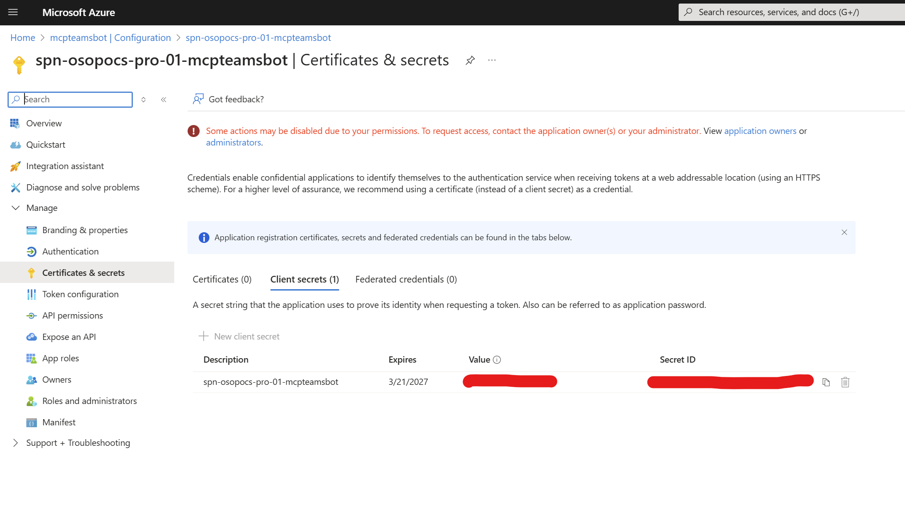
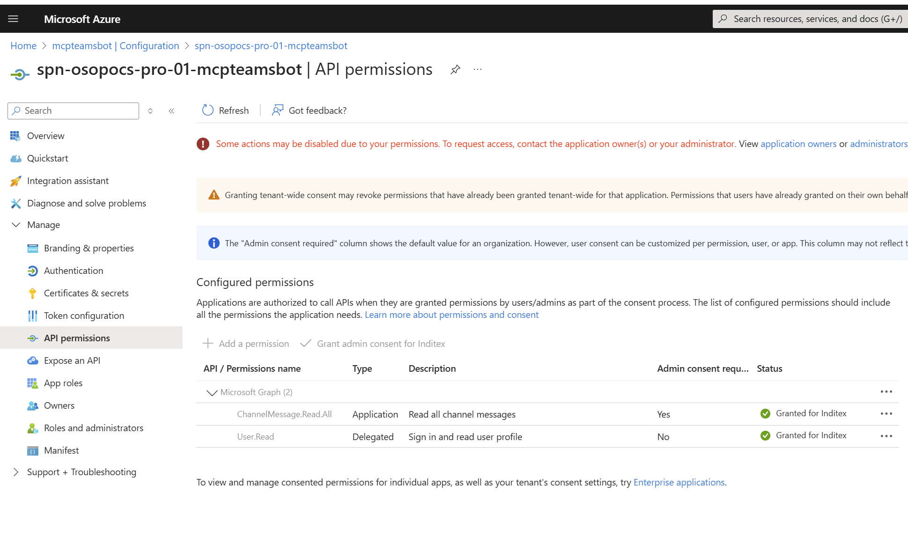
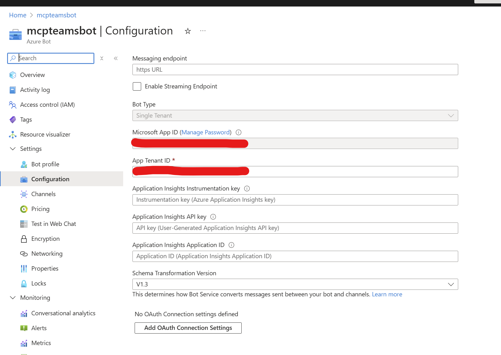
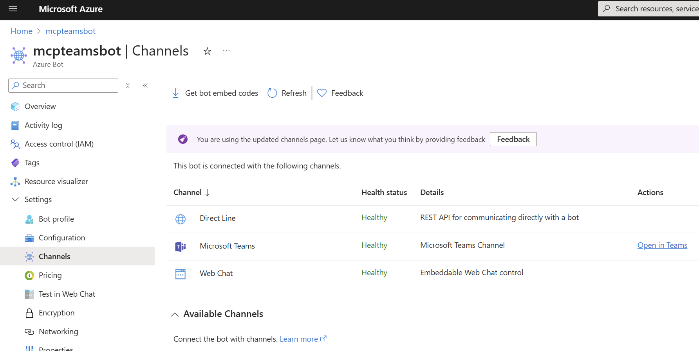
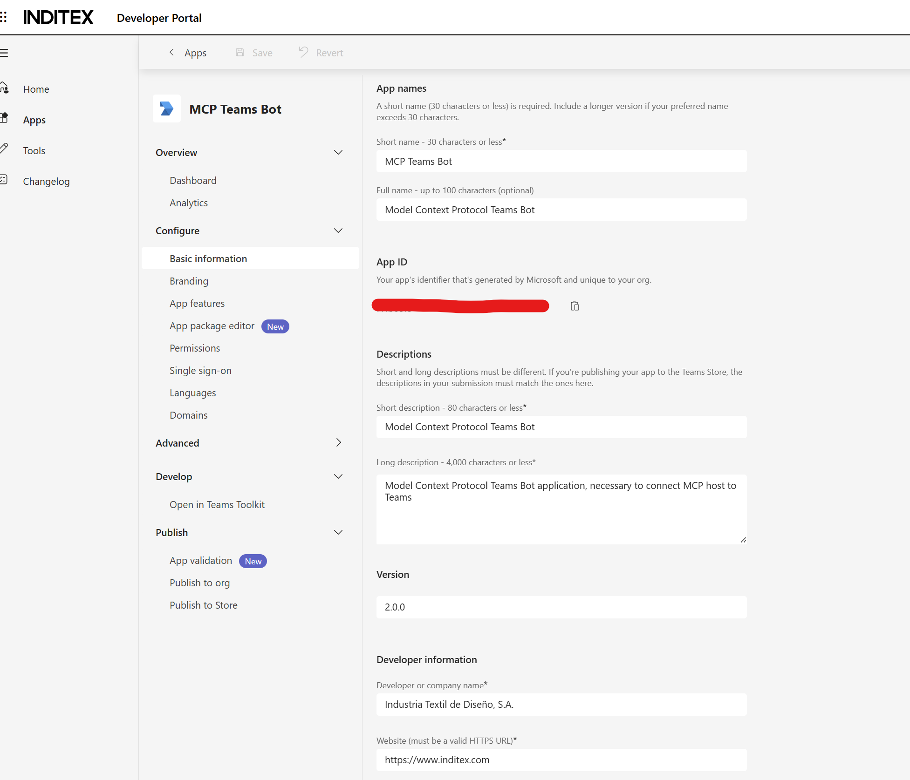
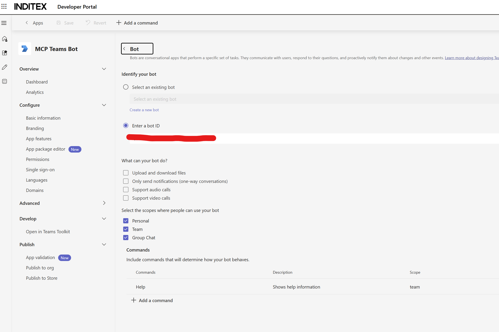
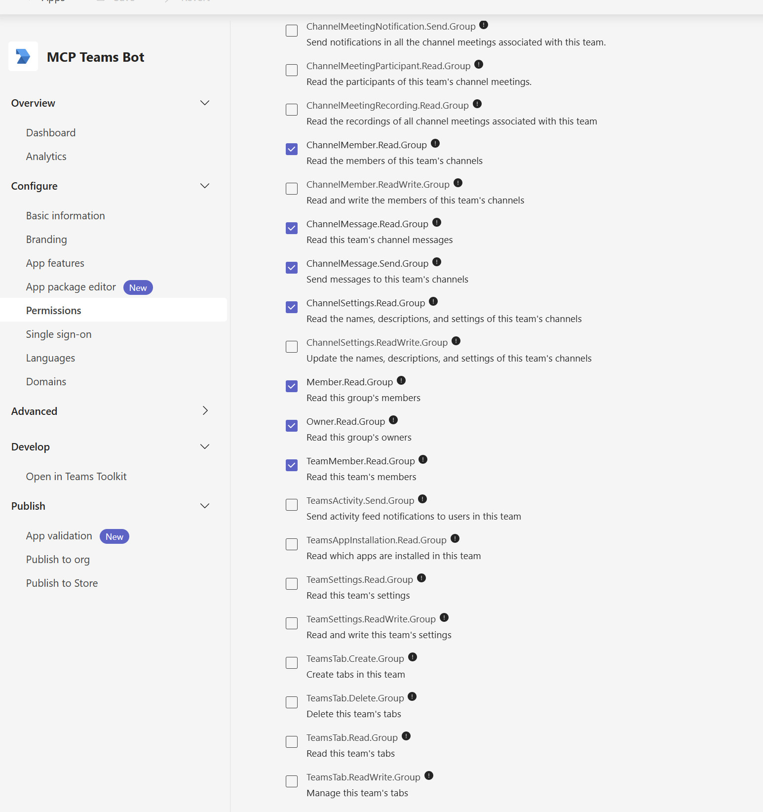
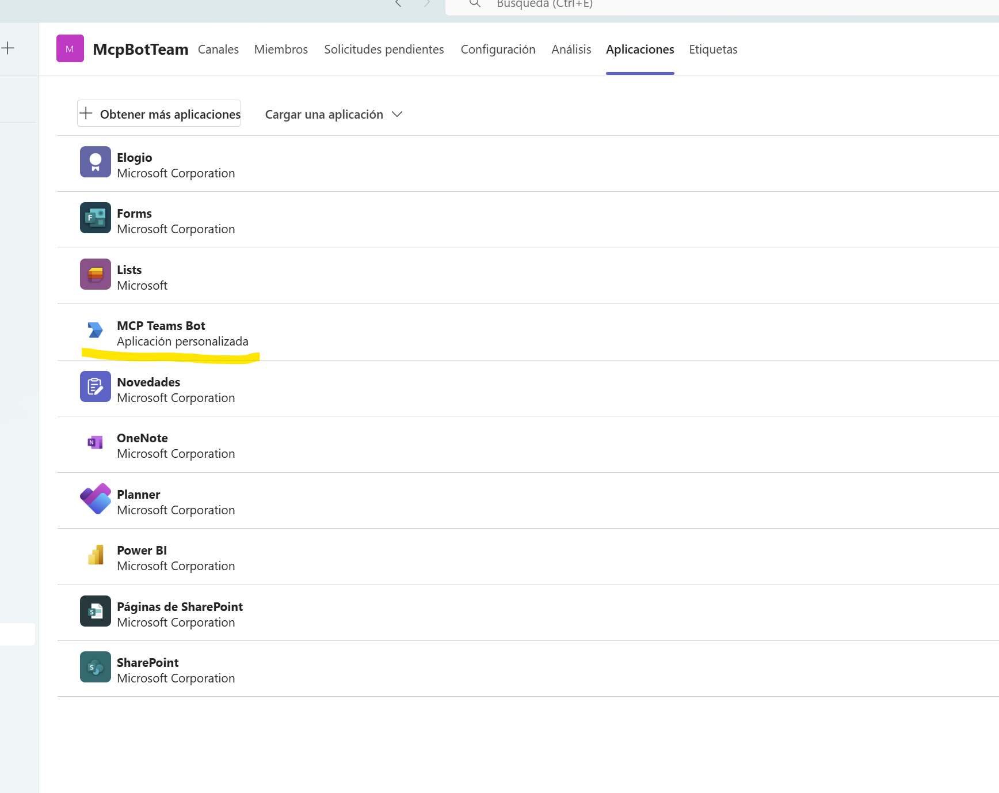
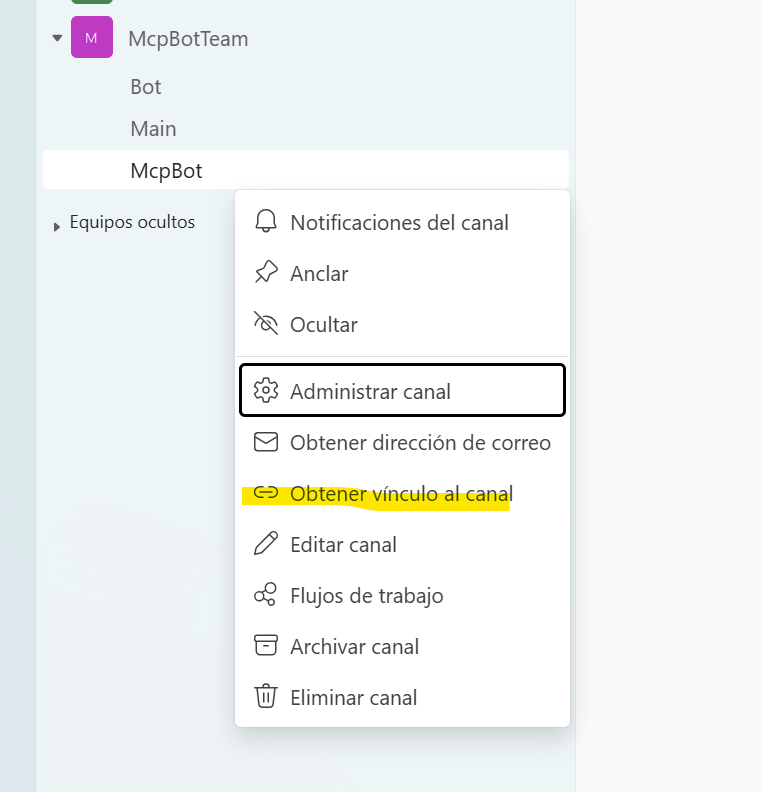

## Teams configuration

### Application registration

You will need to [create and register](https://learn.microsoft.com/en-us/entra/identity-platform/quickstart-register-app?tabs=certificate%2Cexpose-a-web-api) 
a Microsoft Entra ID application. Please keep your application UUID to set the environment variable **TEAMS_APP_ID**.

Microsoft Bot Framework will use [REST Authentication](https://learn.microsoft.com/en-us/azure/bot-service/rest-api/bot-framework-rest-connector-authentication?view=azure-bot-service-4.0&tabs=singletenant#step-1-request-an-access-token-from-the-microsoft-entra-id-account-login-service)

Then you will need to [add a client secret](https://learn.microsoft.com/en-us/entra/identity-platform/how-to-add-credentials?tabs=client-secret) 
to your application. After this you will retrieve your client secret and store it in the environment variable 
**TEAMS_APP_PASSWORD**.

Your organization can either use a Single Tenant or Multi Tenant schema for managing identities. 
In case you use a SingleTenant scheme, please store the tenant UUID in **TEAMS_APP_TENANT_ID** and 
set **TEAMS_APP_TYPE** to SingleTenant.

During development of this MCP Server we used SingleTenant authentication for our demo application 
with client secret credentials.



It is also necessary to setup Microsoft Graph API "ChannelMessage.Read.All" permission. 
This permission is a "Resource Specific Consent" and can be scoped to the team or group where the teams 
application (explained later) is installed.



### Azure Bot registration

After registering the Microsoft Entra ID application, you will need to [register an azure bot](https://learn.microsoft.com/en-us/azure/bot-service/bot-service-quickstart-registration?view=azure-bot-service-4.0&tabs=singletenant). 
The bot will be set with the **TEAMS_APP_ID** existing registration.



The next step is to [connect with teams channel](https://learn.microsoft.com/en-us/azure/bot-service/channel-connect-teams?view=azure-bot-service-4.0)

The bot account is used only as a consumer for the Azure Bot REST api and you will not need to deploy any webapp into Azure. But you will need to install a Microsoft Teams Application with your bot settings.



You will not need to deploy a Bot application in Azure or the Internet because this MCP server uses 
Azure Bot Framework as a client to Bot Framework api.

### Microsoft Teams Application publishing

There is a skeleton for this kind of applications in the [app folder](https://github.com/InditexTech/mcp-teams-server/tree/master/app). 
This skeleton can be used after replacing `{{MICROSOFT_APP_ID}}` by your **TEAMS_APP_ID**, 
using your own icons and zipping the directory to deploy it as an application into Microsoft Teams.

As an alternative you can create and publish the same application with the aid of [Teams developer portal](https://dev.teams.microsoft.com/), 
but remember to add and configure "bot feature" and setup the application required permissions 
("TeamMember.Read.Group", "ChannelMessage.Read.Group", "ChannelMessage.Send.Group", "ChannelSettings.Read.Group", 
"ChannelMember.Read.Group", "Member.Read.Group", "Owner.Read.Group").







This application needs to be installed in a Teams Group



And some information must be extracted from the Teams Group url:



```
https://teams.microsoft.com/l/channel/[TEAMS_CHANNEL_ID]/McpBot?groupId=[TEAM_ID]&tenantId=[TEAMS_APP_TENANT_ID]
```

You will need that information to set up **TEAM_ID** and **TEAMS_CHANNEL_ID** for your bot. 

The MCP teams server will be set up to read and post only in the **TEAM_ID** channels and 
will use by default the **TEAMS_CHANNEL_ID**.